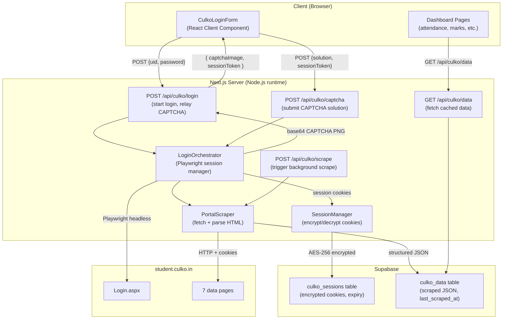

# Design Document: CULKO Portal Scraper

## Overview

This feature integrates the CULKO student portal (`student.culko.in`) into the campus app. It automates the multi-step login (UID → Next → password → CAPTCHA → Login) using a server-side Playwright browser, relays the CAPTCHA image to the user in-app, completes login, scrapes seven data endpoints, and persists the results in Supabase. A background refresh mechanism keeps data current without requiring the user to re-login.

The existing Python/Selenium files (`automated_culko_login.py`, `culko_api_server.py`, `culko_scraper.py`) served as a reference implementation. This design replaces them with a pure TypeScript/Node.js stack that runs inside the Next.js process, eliminating the Python sidecar dependency.

---

## Architecture



### Key Design Decisions

1. **Playwright over Python/Selenium**: Playwright runs natively in Node.js, eliminating the Python sidecar process. The existing `spawn('python', ...)` pattern in `app/api/culko/route.ts` is replaced with a direct `import` of the Playwright library.

2. **In-memory session map for CAPTCHA relay**: The Playwright browser instance must stay alive between the "start login" request and the "submit CAPTCHA" request. A server-side `Map<sessionToken, BrowserContext>` holds open browser contexts keyed by a short-lived UUID token. Contexts are cleaned up after login completes or after a 5-minute TTL.

3. **Supabase for persistence**: Session cookies and scraped data are stored in Supabase (not Next.js cookies), so data survives server restarts and is accessible across devices. The existing `culko_session` HTTP-only cookie approach is replaced with Supabase rows protected by RLS.

4. **Separate API routes**: The existing single `app/api/culko/route.ts` is split into focused routes: `/login`, `/captcha`, `/data`, `/scrape`, and `/disconnect` — each with a single responsibility.

5. **`runtime = 'nodejs'` + `maxDuration`**: Playwright requires the Node.js runtime (not Edge). The login route sets `maxDuration = 120` to accommodate the browser automation timeout.

---

## Components and Interfaces

### API Routes

| Route | Method | Purpose |
|---|---|---|
| `app/api/culko/login/route.ts` | POST | Start login: launch Playwright, fill UID+password, return CAPTCHA image |
| `app/api/culko/captcha/route.ts` | POST | Submit CAPTCHA solution, complete login, trigger initial scrape |
| `app/api/culko/data/route.ts` | GET | Return cached scraped data from Supabase for the authenticated user |
| `app/api/culko/scrape/route.ts` | POST | Trigger a background re-scrape using stored session cookies |
| `app/api/culko/disconnect/route.ts` | POST | Delete session and all scraped data for the user |

### Library Modules

```
lib/culko/
  login-orchestrator.ts   — Playwright browser lifecycle, CAPTCHA capture, login completion
  scraper.ts              — HTTP fetch + HTML parsing for all 7 portal pages (replaces existing)
  session-manager.ts      — AES-256 encrypt/decrypt, Supabase read/write for sessions
  parsers/
    profile.ts
    marks.ts
    attendance.ts
    results.ts
    hostel.ts
    timetable.ts
    courses.ts
```

### Frontend Components

```
components/culko/
  CulkoLoginForm.tsx      — UID/password form + CAPTCHA display + solution input
  CulkoDataView.tsx       — Tabbed view of all scraped data sections
  CulkoStatusBadge.tsx    — Shows connection status + last_scraped_at
```

### Core Interfaces

```typescript
// Session token returned to client after login starts
interface LoginStartResponse {
  sessionToken: string        // UUID, maps to open Playwright context
  captchaImage: string        // base64-encoded PNG
}

// Request to complete login
interface CaptchaSubmitRequest {
  sessionToken: string
  captchaSolution: string
}

// Stored in Supabase culko_sessions
interface CulkoSession {
  id: string                  // Supabase user ID (FK)
  encrypted_cookies: string   // AES-256-GCM ciphertext (hex)
  iv: string                  // AES-256-GCM IV (hex)
  expires_at: string          // ISO timestamp
  created_at: string
}

// Stored in Supabase culko_data
interface CulkoDataRecord {
  id: string                  // Supabase user ID (FK)
  profile: StudentProfile | null
  marks: MarkRecord[]
  attendance: AttendanceRecord[]
  results: ResultRecord[]
  hostel: HostelRecord | null
  timetable: TimetableRecord[]
  courses: CourseRecord[]
  last_scraped_at: string     // ISO timestamp
}

// Scraped data types
interface StudentProfile {
  name: string
  uid: string
  program: string
  semester: string
  section: string
  email?: string
  phone?: string
}

interface AttendanceRecord {
  subject: string
  attended: number
  total: number
  percentage: number
}

interface MarkRecord {
  subject: string
  examType: string
  obtained: number
  total: number
  grade?: string
}

interface ResultRecord {
  semester: string
  sgpa?: number
  cgpa?: number
  subjects: { name: string; grade: string; credits: number }[]
}

interface HostelRecord {
  hostelName: string
  roomNumber: string
  block?: string
  warden?: string
}

interface TimetableRecord {
  day: string
  slots: { time: string; subject: string; room: string; faculty: string }[]
}

interface CourseRecord {
  code: string
  name: string
  credits: number
  faculty: string
  type: string
}
```

---

## Data Models

### Supabase Tables

```sql
-- Stores encrypted portal session cookies per user
CREATE TABLE culko_sessions (
  id UUID PRIMARY KEY REFERENCES auth.users(id) ON DELETE CASCADE,
  encrypted_cookies TEXT NOT NULL,
  iv TEXT NOT NULL,
  expires_at TIMESTAMPTZ NOT NULL,
  created_at TIMESTAMPTZ DEFAULT NOW(),
  updated_at TIMESTAMPTZ DEFAULT NOW()
);

ALTER TABLE culko_sessions ENABLE ROW LEVEL SECURITY;
CREATE POLICY "Users manage own culko session"
  ON culko_sessions FOR ALL
  USING (auth.uid() = id)
  WITH CHECK (auth.uid() = id);

-- Stores the most recently scraped data per user
CREATE TABLE culko_data (
  id UUID PRIMARY KEY REFERENCES auth.users(id) ON DELETE CASCADE,
  profile JSONB,
  marks JSONB DEFAULT '[]',
  attendance JSONB DEFAULT '[]',
  results JSONB DEFAULT '[]',
  hostel JSONB,
  timetable JSONB DEFAULT '[]',
  courses JSONB DEFAULT '[]',
  last_scraped_at TIMESTAMPTZ,
  created_at TIMESTAMPTZ DEFAULT NOW(),
  updated_at TIMESTAMPTZ DEFAULT NOW()
);

ALTER TABLE culko_data ENABLE ROW LEVEL SECURITY;
CREATE POLICY "Users manage own culko data"
  ON culko_data FOR ALL
  USING (auth.uid() = id)
  WITH CHECK (auth.uid() = id);
```

### In-Memory Session Map (Server-Side)

```typescript
// lib/culko/login-orchestrator.ts
// Module-level map — survives across requests in the same Node.js process
const pendingSessions = new Map<string, {
  browser: Browser
  page: Page
  createdAt: number
}>()

// TTL cleanup: sessions older than 5 minutes are closed and removed
```

### Encryption

Session cookies are encrypted with AES-256-GCM before storage:

```typescript
// lib/culko/session-manager.ts
import { createCipheriv, createDecipheriv, randomBytes } from 'crypto'

const KEY = Buffer.from(process.env.CULKO_ENCRYPTION_KEY!, 'hex') // 32-byte key

function encrypt(plaintext: string): { ciphertext: string; iv: string }
function decrypt(ciphertext: string, iv: string): string
```

`CULKO_ENCRYPTION_KEY` is a 64-character hex string (32 bytes) stored in `.env.local`.

---

## Correctness Properties

*A property is a characteristic or behavior that should hold true across all valid executions of a system — essentially, a formal statement about what the system should do. Properties serve as the bridge between human-readable specifications and machine-verifiable correctness guarantees.*

### Property 1: Credential non-persistence

*For any* UID and password submitted to the Login_API, after the login attempt completes (success or failure), neither the UID nor the password should appear in any Supabase table, log file, or HTTP-only cookie.

**Validates: Requirements 2.5, 8.1**

---

### Property 2: Encryption round-trip

*For any* valid session cookie dictionary, encrypting it and then decrypting the result should produce a value equal to the original.

**Validates: Requirements 8.2**

---

### Property 3: Session isolation

*For any* two distinct authenticated app users A and B, user A's session record and scraped data should never be readable or writable by user B's Supabase credentials.

**Validates: Requirements 8.3, 8.4**

---

### Property 4: Attendance percentage invariant

*For any* attendance record returned by the parser, the `percentage` field should equal `Math.round((attended / total) * 100)` when `total > 0`, and `0` when `total === 0`.

**Validates: Requirements 5.2**

---

### Property 5: Parser round-trip (HTML → structured → re-parseable)

*For any* valid HTML page fetched from a Portal endpoint, parsing it should produce a non-null structured object whose fields are all defined types (no `undefined` values in required fields).

**Validates: Requirements 5.2**

---

### Property 6: Scrape partial-failure isolation

*For any* subset of Portal pages that return non-200 responses, the Scraper should still return successfully parsed data for all pages that did return 200, and mark only the failing pages as unavailable.

**Validates: Requirements 5.3**

---

### Property 7: Disconnect completeness

*For any* user who disconnects their Portal account, after the disconnect operation completes, querying `culko_sessions` and `culko_data` for that user's ID should return zero rows.

**Validates: Requirements 8.5**

---

### Property 8: CAPTCHA refresh produces a new image

*For any* active login session, requesting a CAPTCHA refresh should return a base64 PNG that is different from the previously returned CAPTCHA image.

**Validates: Requirements 3.4**

---

## Error Handling

| Scenario | Behavior |
|---|---|
| UID/password field not found within 15s | Close browser, return `{ error: 'Portal structure changed' }` with HTTP 502 |
| CAPTCHA image element not found | Close browser, return `{ error: 'CAPTCHA not found' }` with HTTP 502 |
| Wrong CAPTCHA (Portal shows error) | Capture fresh CAPTCHA, return `{ captchaImage, error: 'Wrong CAPTCHA, try again' }` with HTTP 422 |
| Wrong password (Portal shows error) | Close browser, return `{ error: 'Invalid credentials' }` with HTTP 401 |
| Session token not found (expired/invalid) | Return `{ error: 'Session expired, please restart login' }` with HTTP 410 |
| Portal page returns non-200 during scrape | Mark that data source as `null`, continue scraping others |
| Portal redirects to login during scrape | Mark session as expired in `culko_sessions`, return `{ sessionExpired: true }` |
| Supabase write fails | Return HTTP 500 with error message; do not silently swallow |
| `CULKO_ENCRYPTION_KEY` not set | Throw at startup with a clear message |

---

## Testing Strategy

### Unit Tests

Unit tests cover the pure parsing functions and the encryption utilities, using specific HTML fixtures:

- Each parser (`profile`, `marks`, `attendance`, `results`, `hostel`, `timetable`, `courses`) is tested with a saved HTML fixture from the Portal
- Edge cases: empty tables, missing elements, malformed HTML
- `SessionManager.encrypt` / `decrypt` round-trip with known inputs
- Attendance percentage calculation with boundary values (`total = 0`, `attended = total`, `attended = 0`)

### Property-Based Tests

Property-based tests use **fast-check** (already compatible with the TypeScript/Node.js stack, no additional runtime needed).

Each property test runs a minimum of **100 iterations**.

Tag format: `Feature: culko-portal-scraper, Property {N}: {title}`

| Property | Test approach |
|---|---|
| P2: Encryption round-trip | Generate arbitrary strings (cookie JSON), encrypt then decrypt, assert equality |
| P4: Attendance percentage invariant | Generate arbitrary `{ attended, total }` pairs where `total >= attended >= 0`, assert percentage formula |
| P5: Parser non-null output | Generate structurally valid HTML variants (with/without optional fields), assert no required field is `undefined` |
| P6: Scrape partial-failure isolation | Mock fetch to fail for a random subset of the 7 URLs, assert successful pages still return data |
| P7: Disconnect completeness | Integration test against Supabase test project: insert session + data, disconnect, assert zero rows |
| P8: CAPTCHA refresh produces new image | Mock Playwright page to return different screenshots on successive calls, assert images differ |

### Integration Tests

- Full login flow tested against a mock HTML server that mimics the Portal's multi-step login (no real credentials needed)
- Scrape flow tested with saved HTML fixtures served by a local HTTP server
